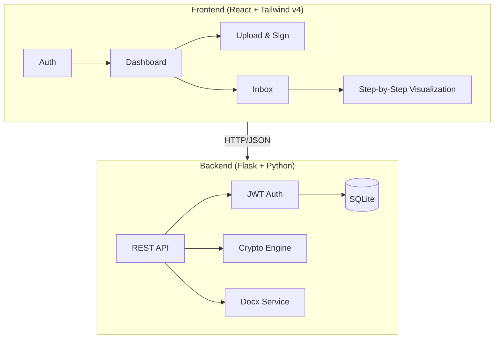

# EduSign — Secure Document Signing & Verification System

EduSign is an educational full-stack web application designed to demonstrate the lifecycle of **Digital Signatures** using **RSA-2048** and **SHA-256**. It provides a visually intuitive, step-by-step breakdown of how cryptographic trust is established between a sender and a receiver.

---

## 🧠 Project Vision
The system is built with **Swiss Design Principles** (minimalism, high whitespace, and clean typography) to make complex cryptography easy to understand for students and professionals.

- **Visual Learning**: Watch the hashing, signing, and verification process in real-time.
- **Academic Demo**: Perfect for Information Security semester projects and vivas.
- **Modern Tech**: Built with React 18, TailwindCSS v4, and Flask.

---

## 🏗️ Architecture



### Key Components:
- **Crypto Engine**: Handles RSA key generation, SHA-256 hashing, and PSS (Probabilistic Signature Scheme) signing/verification.
- **Docx Service**: Extracts raw text content from `.docx` files for hashing.
- **Visualization Panel**: A React-based state machine that animates each step of the signature pipeline.

---

## 🔐 Cryptographic Pipeline

The system implements the standard digital signature lifecycle:

### 1. Signing Phase (Sender)
1. **Extraction**: The raw text is extracted from the uploaded `.docx` file.
2. **Hashing**: A **SHA-256** hash is generated from the text.
3. **Encryption (Signing)**: The hash is encrypted using the sender's **RSA-2048 Private Key**.
4. **Transmission**: The original document and the digital signature are bundled and sent to the receiver.

### 2. Verification Phase (Receiver)
1. **Re-Hashing**: The receiver re-computes the SHA-256 hash of the document they received.
2. **Decryption**: The receiver decrypts the signature using the **Sender's Public Key** to reveal the original hash.
3. **Comparison**: If the re-computed hash matches the decrypted hash, the document is **Authentic** and **Unmodified**.

---

## 📂 Project Structure

```text
Digital_Signature/
├── backend/
│   ├── app.py              # Flask Factory
│   ├── models/             # Database Schemas (User, Document)
│   ├── routes/             # API Endpoints (Auth, Crypto, Docs)
│   ├── services/           # Crypto & Docx Logic
│   └── uploads/            # Document Storage
├── frontend/
│   ├── src/
│   │   ├── components/     # UI Components & Visualization Steps
│   │   ├── pages/          # Full Page Layouts
│   │   ├── context/        # Auth State Management
│   │   └── api/            # Axios Client
│   └── index.css           # Tailwind v4 Swiss Design System
└── README.md
```

---

## 🚀 Getting Started

### Prerequisites
- Python 3.9+
- Node.js 18+

### 1. Setup Backend
```bash
cd backend
pip install -r requirements.txt
python app.py
```
*Backend runs on `http://localhost:5000`*

### 2. Setup Frontend
```bash
cd frontend
npm install
npm run dev
```
*Frontend runs on `http://localhost:5173`*

---

## 🧪 Educational Features
- **Explain Step**: Click the "Explain" button on any step to see the underlying mathematical logic.
- **Tamper Demo**: Use the "Tamper" button in the Inbox to modify a document post-signing and watch the verification fail in real-time.
- **Key Inspection**: View your generated RSA public and private keys (educational purposes only).

---

## 🛡️ Security Disclaimer
This project is for **educational purposes only**. While it uses industry-standard RSA and SHA-256, it stores private keys in a database to simplify the demonstration. Do not use this for production document signing.
