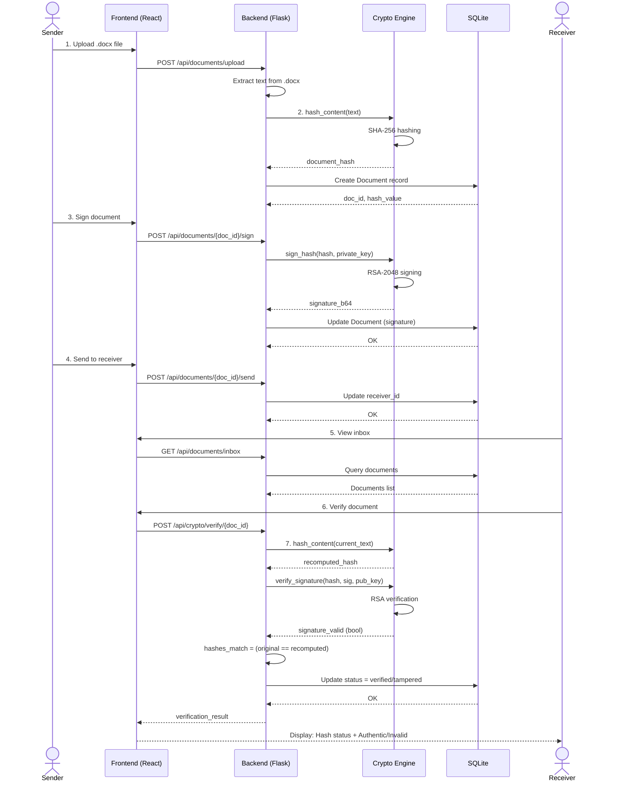

# DocDrop: High-Doodly Secure Digital Signatures

DocDrop is a stylized, full-stack platform for authenticating and verifying the integrity of documents using industry-standard cryptographic primitives. It features a unique "Doodly" sketchbook aesthetic while maintaining enterprise-grade security using RSA-2048 for asymmetric encryption and SHA-256 for secure message hashing.

---

## 🎨 Visual Identity: The Doodly Style
DocDrop blends a professional cryptographic tool with a playful, hand-drawn sketchbook aesthetic.
- **Notebook Design System**: Custom ruled-paper backgrounds and margin lines.
- **Hand-Drawn UI**: Borders, buttons, and icons rendered with `Rough.js` for a sketchy, organic feel.
- **Dynamic Parallax**: Background doodles that move subtly as you interact with the dashboard.
- **Custom Typography**: Using curated handwriting fonts (Architects Daughter, Gochi Hand, Patrick Hand).

---

## 🛠️ Technical Stack

### Backend (Secure Node)
- **Framework**: Flask (Python) with SQLAlchemy ORM.
- **Cryptography**: `cryptography` library implementing **RSA-PKCS1v1.5** padding and **RSA key generation / signature verification**.
- **Hashing**: Python standard library `hashlib` for **SHA-256** document hashing.
- **Document Reading**: `python-docx` for extracting text from `.docx` files.
- **Authentication**: Stateless JWT (JSON Web Tokens) with secure session restoration.
- **Database**: SQLite (Relational).

### Libraries Used

#### Backend Libraries
- **Flask**: API server and route handling.
- **flask-sqlalchemy**: ORM layer for users and documents.
- **flask-jwt-extended**: JWT authentication and route protection.
- **flask-cors**: Cross-origin request support for the frontend.
- **cryptography**: RSA key generation, signing, and signature verification.
- **python-docx**: Reads and extracts text from Word `.docx` documents.
- **werkzeug**: Flask utility functions used by the backend stack.

#### Python Standard Library Modules
- **hashlib**: SHA-256 document hashing.
- **base64**: Encodes and decodes RSA signatures.
- **os**: File and path handling in the document service.

#### Frontend Libraries
- **React**: User interface.
- **react-router-dom**: Page routing.
- **framer-motion**: Animations and transitions.
- **roughjs**: Hand-drawn sketch-style rendering.
- **axios**: API requests.
- **lucide-react** and **react-icons**: UI icons.
- **tailwindcss** and **@tailwindcss/vite**: Styling and build integration.

### Frontend (User Interface)
- **Framework**: React 19 (Vite)
- **Styling**: TailwindCSS v4 + Vanilla CSS Design Tokens.
- **Animations**: Framer Motion (Parallax, micro-interactions, layout transitions).
- **Sketchy Rendering**: Rough.js (Canvas-based hand-drawn aesthetics).
- **Icons**: Custom DoodleIcon library powered by Rough.js.

---

## 🔐 Cryptographic Workflow

### 1. Registration & Key Generation
Upon registration, the system generates a 2048-bit RSA keypair for the user. The public key is stored for verification by others, while the private key is used to sign documents.

### 2. Document Signing (RSA-PKCS1v1.5)
1. **Hashing**: The system generates a **SHA-256** digest of the document content.
2. **Signing**: The digest is signed using the sender's **Private Key** with **PKCS1v1.5** padding, ensuring compatibility and deterministic verification.
3. **Packaging**: The signature is attached to the document metadata and sent to the receiver.

### 3. Verification & Integrity Check
1. **Re-Hashing**: The receiver generates a new SHA-256 digest from the received document content.
2. **Decryption/Verification**: The original signature is verified against the re-computed hash using the sender's **Public Key**.
3. **Comparison**: If the signature is valid for the given hash, the document is verified as authentic and untampered.

---

## 📊 System Diagrams

### Sequence Diagram: Document Signing & Verification Flow



### Class Diagram: Data Models & Architecture

```mermaid
classDiagram
    class User {
        +id: str
        +username: str
        +email: str
        +password_hash: str
        +public_key: str
        +private_key: str
        +created_at: datetime
    }

    class Document {
        +id: str
        +original_filename: str
        +sender_id: str
        +receiver_id: str
        +text_content: str
        +hash_value: str
        +signature: str
        +status: str
        +file_path: str
        +created_at: datetime
        +updated_at: datetime
    }

    class CryptoEngine {
        +generate_key_pair() (str, str)
        +hash_content(text: str) str
        +sign_hash(hash_hex: str, private_key: str) str
        +verify_signature(hash_hex: str, sig_b64: str, pub_key: str) bool
    }

    class DocxService {
        +extract_text(file_path: str) str
        +validate_docx(filename: str) bool
    }

    class AuthRoutes {
        +POST /register
        +POST /login
        +GET /me
    }

    class DocumentRoutes {
        +POST /upload
        +POST /{id}/sign
        +POST /{id}/send
        +GET /inbox
        +GET /sent
        +POST /{id}/tamper
    }

    class CryptoRoutes {
        +POST /verify/{id}
    }

    User "1" -- "*" Document : sends
    User "1" -- "*" Document : receives
    DocumentRoutes -- Document : manages
    DocumentRoutes -- CryptoEngine : uses
    DocumentRoutes -- DocxService : uses
    CryptoRoutes -- CryptoEngine : uses
    CryptoRoutes -- Document : verifies
    AuthRoutes -- User : manages
```

---

## 🎓 Educational Features

DocDrop includes features designed to demonstrate cryptographic concepts in a tangible way:

### 🔬 Tamper Simulation
Users can manually "tamper" with a document in their inbox. This physically modifies the `.docx` file on the server (appending hidden text). When the user subsequently runs a "Verification" check, the system will detect that the file hash no longer matches the digital signature, demonstrating a failed integrity check.

### 🔍 Crypto Pipeline Visualization
The verification process is broken down into steps, showing the re-computed hash and the signature validation status, making the "behind-the-scenes" math visible.

---

## 🚀 Installation and Deployment

### Prerequisites
- Python 3.10+
- Node.js 18+
- npm or yarn

### Backend Setup
1. **Install dependencies**:
   ```bash
   cd backend
   pip install -r requirements.txt
   ```
2. **Run the API server**:
   ```bash
   python app.py
   ```
   *The server will start on `http://localhost:5000`*

### Frontend Setup
1. **Install dependencies**:
   ```bash
   cd frontend
   npm install
   ```
2. **Start the development server**:
   ```bash
   npm run dev
   ```
   *The app will be available on `http://localhost:5173` (or `5174` if 5173 is busy)*

---

## 📂 Project Structure

```text
DocDrop/
├── backend/
│   ├── app.py              # Flask Application Factory
│   ├── config.py           # Environment & App Config
│   ├── models/             # Database Schemas (User, Document)
│   ├── routes/             # API Blueprints (Auth, Docs, Crypto)
│   ├── services/           # Logic (Crypto Engine, File Handling)
│   └── instance/           # Local SQLite Database
├── frontend/
│   ├── src/
│   │   ├── components/     # Rough.js Wrappers & Sidebar
│   │   ├── pages/          # View Layers (Login, Upload, Inbox)
│   │   ├── context/        # Auth & Global State
│   │   └── api/            # Axios Client & Interceptors
│   └── index.css           # Doodly Design Tokens
└── README.md               # You are here
```

---

## 🔒 Security Considerations
DocDrop is designed as an educational and demonstration platform for cryptographic principles. In a production environment, private keys should be managed via Hardware Security Modules (HSMs) or Secure Enclaves, and the system should be deployed using HTTPS with strict CORS policies.
