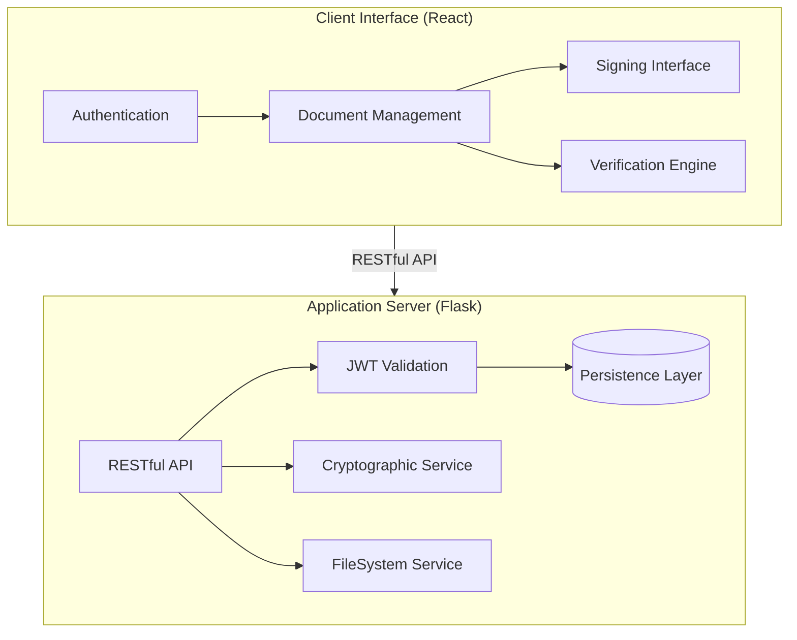

# DocDrop: Secure Document Signing & Verification

DocDrop is a full-stack platform for authenticating and verifying the integrity of Word documents using industry-standard cryptographic primitives. The system implements a robust digital signature lifecycle utilizing RSA-2048 for asymmetric encryption and SHA-256 for secure message hashing.

---

## Technical Overview

The application is architected with a decoupled frontend and backend to ensure scalability and maintainability.

### Key Technologies
- **Backend**: Flask (Python) with SQLAlchemy ORM.
- **Frontend**: React 18 with TailwindCSS v4.
- **Cryptography**: Python `cryptography` library (RSA-PSS, SHA-256).
- **Authentication**: Stateless JWT (JSON Web Tokens).
- **Database**: SQLite (Relational).

---

## System Architecture



### Cryptographic Implementation
The system strictly adheres to modern cryptographic standards:
- **Hashing**: SHA-256 is used to generate immutable document digests.
- **Signature Padding**: RSA-PSS (Probabilistic Signature Scheme) is employed to provide high security and resistance against chosen-ciphertext attacks.
- **Key Storage**: 2048-bit RSA keys are generated per-user upon registration.

---

## Cryptographic Workflow

### Document Signing
1. **Extraction**: Raw text is parsed from the uploaded OpenXML (.docx) file.
2. **Hashing**: A SHA-256 digest is generated from the document payload.
3. **Encryption**: The digest is signed using the sender's private RSA key with PSS padding.
4. **Distribution**: The signed document package is made available to the intended recipient.

### Verification Logic
1. **Digest Generation**: The recipient's system re-hashes the document content using SHA-256.
2. **Signature Decryption**: The transmitted signature is decrypted using the sender's public key.
3. **Integrity Validation**: The re-computed hash is compared against the decrypted signature hash. A mismatch indicates data tampering or unauthorized modification.

---

## Installation and Deployment

### Backend Setup
1. Initialize the Python environment:
   ```bash
   cd backend
   pip install -r requirements.txt
   ```
2. Launch the application server:
   ```bash
   python app.py
   ```

### Frontend Setup
1. Install dependencies:
   ```bash
   cd frontend
   npm install
   ```
2. Start the development server:
   ```bash
   npm run dev
   ```

---

## Project Structure

```text
DocDrop/
├── backend/
│   ├── app.py              # Application entry point
│   ├── models/             # Relational data models
│   ├── routes/             # API controller logic
│   ├── services/           # Cryptographic and file services
│   └── uploads/            # Encrypted document storage
├── frontend/
│   ├── src/
│   │   ├── components/     # Reusable UI components
│   │   ├── pages/          # View controllers
│   │   ├── context/        # State management
│   │   └── api/            # HTTP client configuration
│   └── index.html          # Main entry point
└── README.md               # System documentation
```

---

## Security Considerations
The current implementation utilizes standard cryptographic libraries. For high-security environments, it is recommended to integrate Hardware Security Modules (HSMs) for private key management and move to a containerized deployment (Docker/Kubernetes).

