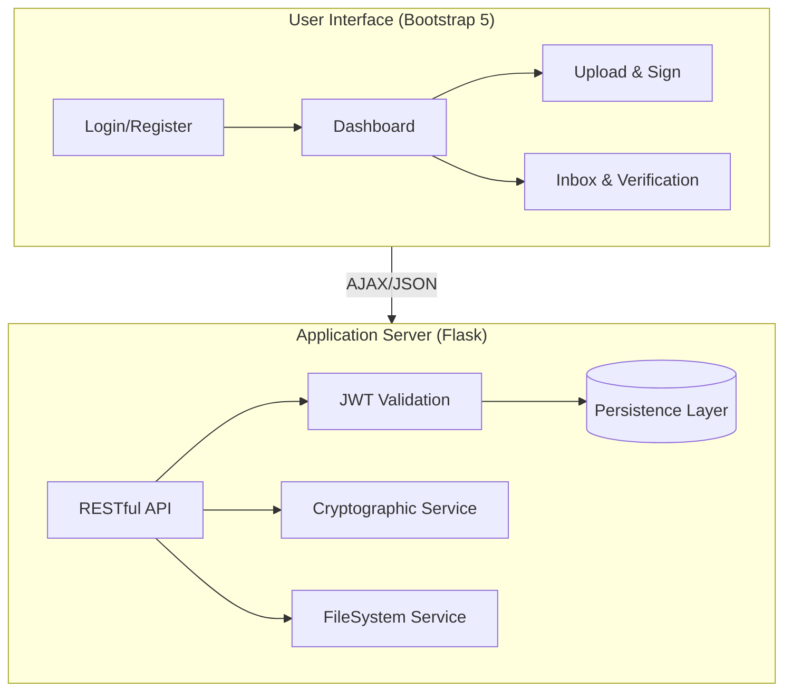

# DocDrop: Secure Document Signing & Verification

DocDrop is a full-stack platform for authenticating and verifying the integrity of Word documents using industry-standard cryptographic primitives. The system implements a robust digital signature lifecycle utilizing RSA-2048 for asymmetric encryption and SHA-256 for secure message hashing.

---

## Technical Overview

The application is architected as a monolithic Flask application with a Bootstrap 5 frontend for high performance and deployment simplicity.

### Key Technologies
- **Server**: Flask (Python) with SQLAlchemy ORM.
- **Frontend**: Bootstrap 5 (Vanilla JavaScript).
- **Cryptography**: Python `cryptography` library (RSA-PSS, SHA-256).
- **Authentication**: Stateless JWT (JSON Web Tokens).
- **Database**: SQLite (Relational).

---


## System Architecture



---

## Cryptographic Workflow

### Document Signing
1. **Extraction**: Raw text is parsed from the uploaded OpenXML (.docx) file.
2. **Hashing**: A SHA-256 digest is generated from the document payload.
3. **Encryption**: The digest is signed using the sender's private RSA key with PSS padding.
4. **Distribution**: The signed document package is made available to the intended recipient.

### Verification Logic
1. **Digest Generation**: The recipient re-hashes the document content using SHA-256.
2. **Signature Decryption**: The transmitted signature is decrypted using the sender's public key.
3. **Integrity Validation**: The re-computed hash is compared against the decrypted signature hash.

---

## Installation and Deployment

### Launch Instructions
1. Initialize the Python environment:
   ```bash
   cd backend
   pip install -r requirements.txt
   ```
2. Launch the application:
   ```bash
   python app.py
   ```
3. Access the application at: `http://localhost:5000`

---

## Project Structure

```text
DocDrop/
├── backend/
│   ├── app.py              # Application entry point & UI routes
│   ├── models/             # Relational data models
│   ├── routes/             # API controller logic
│   ├── services/           # Cryptographic and file services
│   ├── static/             # Static assets (JS/CSS)
│   ├── templates/          # HTML templates (Bootstrap 5)
│   └── uploads/            # Encrypted document storage
└── README.md               # System documentation
```

---

## Security Considerations
The current implementation utilizes standard cryptographic libraries. For high-security environments, it is recommended to integrate Hardware Security Modules (HSMs) for private key management and move to a containerized deployment (Docker/Kubernetes).


